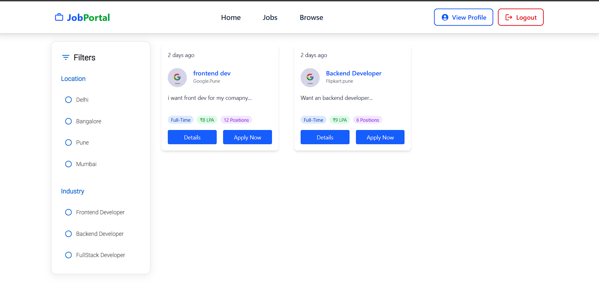
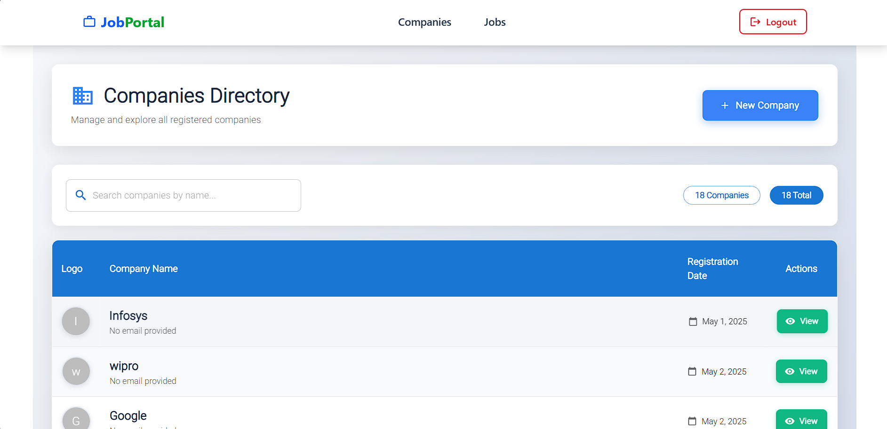
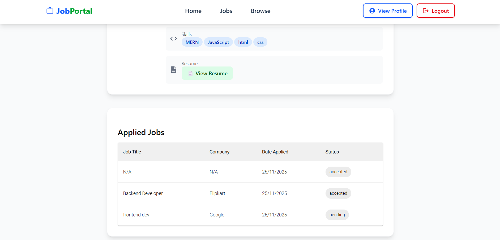

# JobPortal — MERN Stack Job Posting & Recruitment Platform

JobPortal is a full-stack web application built using the **MERN stack** that allows users to search for jobs, apply online, and manage their profiles.  
Admins can create job listings, view applicants, and manage job postings from a dedicated dashboard.

This project demonstrates **real-world job platform functionalities** with clean UI, authentication, forms, filters, and full CRUD operations.


##  Key Features

###  User Features
-  Secure Login & Registration  
-  Browse jobs with filters (title, category, location, experience)  
-  View complete job description  
- Apply to jobs & upload resume  
- Track applied jobs  
- Manage & update profile  

###  Admin Features
- Create Company
- Create new job posts  
- Update or delete jobs  
- View all applicants  
-View Applicants profile and update Status

##  Tech Stack

### **Frontend**
- React.js  
- Vite  
- Tailwind CSS  
- Axios  
- React Router  

### **Backend**
- Node.js  
- Express.js  
- MongoDB + Mongoose  
- JWT Authentication  
- Multer (Resume Upload)
- Cloudinary
- CORS  

---
## Screenshots

| Home Page | Job Listings | Create Job |
|-----------|-------------|------------|
|  |  |  |

| User Profile | 
|--------------|
|  | 


##  Folder Structure

```
JobPortal/
│── backend/
│   ├── controllers/
│   ├── middleware/
│   ├── models/
│   ├── routes/
│   ├── config/
│   └── server.js
│
└── frontend/
├── public/
├── src/
│   ├── components/
│   ├── pages/
│   └── App.jsx

```

---

## ⚙️ Installation & Setup

###  Clone the Repository
```bash
git clone https://github.com/Vaishnavi/jobportal.git

cd jobportal
```

---

##  Backend Setup
```bash
cd backend
npm install
```

Create `.env` file:

```
MONGO_URI=your_mongodb_url
JWT_SECRET=your_secret_key
PORT=8080
```

Start backend:
```bash
nodemon index.js
```

---

## Frontend Setup
```bash
cd ../frontend
npm install
npm run dev
```

---

## 🔗 API Endpoints Overview

### **Authentication**
| Method | Endpoint | Description |
|--------|----------|-------------|
| POST | `/api/v1/auth/register` | Register new user |
| POST | `/api/v1/auth/login` | Login user |

### **Jobs**
| Method | Endpoint | Description |
|--------|----------|-------------|
| GET | `/api/v1/jobs` | Fetch all jobs |
| GET | `/api/v1/jobs/:id` | Fetch job by ID |
| POST | `/api/v1/jobs` | Create job (Admin) |
| PUT | `/api/v1/jobs/:id` | Update job |
| DELETE | `/api/v1/jobs/:id` | Delete job |


### **Applications**
| Method | Endpoint | Description |
|--------|----------|-------------|
| POST | `/api/v1/apply` | Apply for job |
| GET | `/api/v1/applications/:userId` | Get applications by user |

---

##  Features Highlight

- Fully responsive UI with Tailwind  
- Real-time updates for admin job management  
-  JWT-based authentication  
-  Resume upload with Multer  
- End-to-end MERN application  

---

##  Future Improvements (Optional)
- Role-based admin authentication  
- Company profiles  
- Interview scheduling  
- Search suggestions & AI job recommendations  

---

## Author
**Vaishnavi — Full Stack Developer**

---

##  License
MIT License  